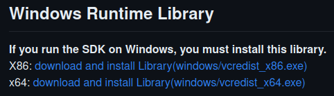

# MPORG

MPORG (short for MP3 ORGanizer) is a python package designed to organize music files in a given directory.

## Table of Contents
- [Project Description](#project-description)
- [Installation](#Installation)
- [Usage](#usage)
- [Configuration](#configuration)
- [Contributing](#contributing)
- [Credits](#credits)
- [License](#license)

## Project Description
The project aims to organize music files. It uses mutagen to query the Spotify api using stored metadata, and if that fails, uses Audio fingerprinting. (Currently via ACRCloud and AcoustID/MusicBrainz).
This will hopefully make it easier to organize my music libraries in a consistent manner. 
## Installation
### Normal Installation
To install this project for normal use
1. Use pip:
   ```bash
   pip install git+https://github.com/Drag-3/MP3ORG.git
   ```
### Dev Installation
To install in order to edit or modify
1. Clone this repo
      ```bash
      git clone https://github.com/Drag-3/MP3ORG.git
      ```
2. Navigate to the cloned directory
    ```bash
    cd mporg
    ```
3. On WINDOWS DEVICES ONLY, install the required dlls for acrcloud to work from the acrcloud [Github](https://github.com/acrcloud/acrcloud_sdk_python). This must be done before you use the requirements file.

   
4. Install the required dependencies:
    ```bash
   pip install -r requirements.txt  OR pip install -r requirements_tests.txt
    ```
   
## Usage
Upon a normal run MPORG will search search-path for music files, and copy organized files to store-path
```bash
mporg -[vhVfam] <store-path> <search-path>
```
If search-path is not provided MPORG will search the directory the script was run from (pwd)
```bash
mporg -[vhVfam] <store-path>
```
If run with no arguments, MPORG will save organized music to $HOME/Music/TuneTagLibrary
```bash
mporg -[vhVfam]
```

You can also specify command line options to customize the behaviour of the script.
Run the following command to see all the available options
```bash
mporg -h
```

## Configuration
Upon start MPORG will prompt for the credentials it will use if they are not saved.

MPORG uses the spotify API to look up track and artist information, so you will have to set up a Spotify developer account in order to get a client ID and secret.

You can obtain those here at the [Spotify Developer Website](https://developer.spotify.com/).

For Audio Fingerprinting MPORG uses ACRCloud and AcoustID.

You can gain ACRCloud Credentials by signing up for their [service](https://console.acrcloud.com). Keep in mind it is a paid API.

You can get an AcoustID api key, be registering an application with [AcoustID](https://acoustid.org/new-application). The AcoustID and MusicBrainz APIs are free to use.

## Contributing
Pull Requests are always welcome, God knows I need help.
For major changes just open an issue discussing what is and why you would like to make the change.
## Credits
MPORG was created by Drag (Justin Erysthee)

## License
MPORG is licensed under the GPL-3.0 license


This README is good for version 0.1a1