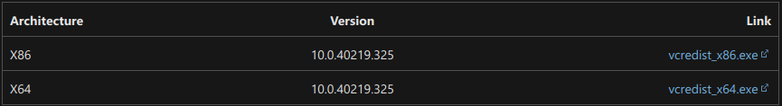

# MPORG

MPORG (short for MP3 ORGanizer) is a Python package designed to organize music files in a given directory.

[](https://github.com/Drag-3/MP3ORG/actions/workflows/python-app.yml)
[](https://www.python.org/downloads/release/python-3100/)
[](https://opensource.org/licenses/GPL-3.0)

## Table of Contents
- [Project Description](#project-description)
- [Installation](#installation)
- [Usage](#usage)
- [Configuration](#configuration)
- [Plugins](#plugins)
- [Contributing](#contributing)
- [Credits](#credits)
- [License](#license)

## Project Description
The project aims to organize music files. It uses mutagen to get stored metadata in order to query the Spotify API, and if that fails, it uses audio fingerprinting (currently via ACRCloud and AcoustID/MusicBrainz). This will hopefully make it easier to organize music libraries in a consistent manner.

## Installation
### Normal Installation


To install this project for normal use:

1. **WINDOWS ONLY**: Download and install Visual Studio 2010 (VC++ 10.0) SP1 from [this link](https://learn.microsoft.com/en-US/cpp/windows/latest-supported-vc-redist?view=msvc-170#visual-studio-2010-vc-100-sp1-no-longer-supported). This is a mandatory step as the project relies on it to function correctly on Windows.
   

2. Install the project using pip:
   ```bash
   pip install git+https://github.com/Drag-3/MPORG.git
   ```

3. Install External Dependencies:
   - On Linux:
     - Install chromaprint using your distribution's package manager. For example:
       ```bash
       apt install ffmpeg libchromaprint-dev libchromaprint-tools
       ```
       ```bash
        pacman -S ffmpeg chromaprint
       ```
       ```bash
          zypper install ffmpeg chromaprint-fpcalc
       ```
     - If you choose to install chromaprint from the acoustid [Website](https://acoustid.org/chromaprint), ensure that you add fpcalc to your PATH. This is required for the program to detect and use fpcalc properly.
   - On Windows:
     - If you haven't already, install chromaprint from the acoustid [Website](https://acoustid.org/chromaprint).
     *Note: If you have winget installed, you can install ffmpeg using the following command:
     ```bash
      winget install Gyan.FFmpeg
     ```

### Dev Installation

To install the project for editing or modification:

1. Clone this repository:
   ```bash
   git clone https://github.com/Drag-3/MPORG.git
   ```

2. Navigate to the cloned directory:
   ```bash
   cd mporg
   ```

3. **WINDOWS DEVICES ONLY**: Before using the requirements file, ensure that you have Visual Studio 2010 (VC++ 10.0) SP1 installed. If you haven't installed it yet, you can download it from [Microsoft](https://learn.microsoft.com/en-US/cpp/windows/latest-supported-vc-redist?view=msvc-170#visual-studio-2010-vc-100-sp1-no-longer-supported). This step is necessary for ACRCloud to work correctly.

   

4. Install chromaprint and its dependencies, following the instructions mentioned in the "Normal Installation" section.

5. Install the required dependencies:
   ```bash
   pip install -r requirements.txt
   ```
   This will ensure all the necessary packages for running the program are installed.

   If you need to run the test suite, use the following command instead:
   ```bash
   pip install -r requirements_tests.txt
   ```
   This will install additional dependencies required for running the tests.
   
## Usage
### Basic Usage
To run MPORG with default options, use the following command:
```bash
mporg [store-path] [search-path]
```
- If the `store-path` is not provided, MPORG will save organized music to `$HOME/Music/TuneTagLibrary`.
- If the `search-path` is not provided, MPORG will search the current directory.

### Command Line Options
You can specify the following command line options to customize the behavior of MPORG:

- `-v`, `--version`: Show the version of MPORG and exit.
- `-l`, `--log_level`: Logging level for the console screen. Specify an integer value.
- `-af`, `--all_fingerprint`: Use all installed fingerprinter plugins.
- `-f`, `--fingerprint`: Use specified fingerprinter.
- `-p`, `--pattern_extension`: Extension(s) to copy over, space separated.
- `-y`, `--lyrics`: Attempt to get lyrics and store with file.
- `--install-plugins`: Install specified plugins, space separated.

### Examples
- To run MPORG with a specific store path and search path:
  ```bash
  mporg /path/to/store /path/to/search
  ```

- To run MPORG with custom options:
  ```bash
  mporg -l 2 -af
  ```
  ```bash
  mporg Music Downloads -f MB l 1 -p flac oga wma -y
  ```
  

### Additional Help
To see all available options and their descriptions, run the following command:
```bash
mporg -h
```

## Configuration
Upon start, MPORG will prompt for the credentials it will use if they are not saved.

To utilize MPORG's features, you need to set up a Spotify developer account to obtain a client ID and secret. Follow these steps:

1. Visit the [Spotify Developer Website](https://developer.spotify.com/) to create an account.
2. Obtain your client ID and secret from the developer dashboard.


For audio fingerprinting, MPORG relies on ACRCloud and AcoustID. Here's how to set them up:

1. Sign up for ACRCloud's [service](https://console.acrcloud.com). Please note that ACRCloud is a paid API.
2. To acquire an AcoustID API key, register your application with [AcoustID](https://acoustid.org/new-application). The AcoustID and MusicBrainz APIs are free to use.


## Plugins
MPORG supports plugins for fingerprints. With future plans to support lyrics and more. Plugins will allow the project to better fit your independent needs.

### Creating Plugins
To create a plugin, you need three main things:
- A repo or other service to host your plugin.
- A `plugin.json` file to describe your plugin.
- A `*Plugin.py` file to contain your plugin's code.

#### `plugin.json`
The `plugin.json` file is used to describe your plugin. It contains the following fields:
- `name`: The name of your plugin.
- `type`: The type of plugin. Currently, only `FingerprinterPlugin` is supported.
- `dependencies`: A list of dependencies required for your plugin to function. This is a list of strings. And it can include git URLs, PyPI package names, and local file paths.
- `modules`: A list of modules to import. This is a list of dicts. One of these must be the entry point for your plugin. Each dict must contain a `name` field and an `url` field. The `name` field is the desired filename of the module. The `url` field is the URL to the module. This will be a direct url to the file. For example, if you are hosting your plugin on GitHub, the URL will be in the format `https://raw.githubusercontent.com/<username>/<repo>/<branch>/<path/to/file>`. The `name` field will be the filename of the file at the end of the URL. For example, if the URL is `https://raw.githubusercontent.com/Drag-3/MPORG/main/mporg/plugins/acrcloud/ACRCloudPlugin.py`, the `name` field will be `ACRCloudPlugin.py`.

##### Example
```json
{
    "name": "MyFingerprintPlugin",
    "type": "FingerprinterPlugin",
    "dependencies": ["dependency1", "dependency2"],
    "modules": [
        {
            "name": "MyFingerprintPlugin.py",
            "url": "https://github.com/user/my-fingerprint-plugin/raw/main/MyFingerprintPlugin.py"
        }
    ]
}
```

#### `*Plugin.py`
The `*Plugin.py` file is the entry point for your plugin. The plugin type determines what class you must implement. Currently, only `FingerprinterPlugin` is supported.
- `FingerprinterPlugin`: This plugin type must include a `fingerprint` method. This method must take a file path as an argument and return a `Track` object.
The *Plugin.py file can optionally also contain a class derived from `CredentialProvider`. This class must implement the `get_credentials` method. This method must return a dictionary containing the credentials required for your plugin to function. It may also optionally implement a `verify_credentials` method. This method must return a boolean value indicating whether the credentials are valid.
Any amount of imports or setup can be made as long as these two methods are implemented.

##### Example
```python
#MyFingerprinterPlugin.py
from mporg.audio_fingerprinter import Fingerprinter
from mporg.types import Track

class MyFingerprintPlugin(Fingerprinter):
    def fingerprint(self, file_path):
        # Do fingerprinting here
        return Track() # Return a Track object with information about the file
```

#### Plugin Repos
Plugin repos are simply git repositories that contain plugins. They must contain a `plugin.json` file and a `*Plugin.py` file. They may also contain any other files or folders required for the plugin to function. The files can be in any directory structure. The plugin repo can be hosted on any service that supports git.

### Using Plugins
To use a plugin, you must first install it. This can be done by running the following command:
```bash
mporg --install-plugins [plugin1] [plugin2] ...
```
This will install the specified plugins. The plugins will be installed in the `$HOME/.mporg/plugins` directory. This directory will be created if it does not exist.
Currently only fingerprinter plugins are supported. To use a fingerprinter plugin, you must specify it in the command line options. This can be done by using the `-f` or `--fingerprint` option. For example:
```bash
mporg -f MyFingerprintPlugin
```
otherwise you can use `-af` to use all installed fingerprinter plugins:
```bash
mporg -af
```

### Plugin Guidelines
- Plugins can be hosted on any site that offers text storage and retrieval. This includes GitHub, GitLab, and Pastebin. However, GitHub is the recommended site for hosting plugins.
- Plugins must be hosted in a public repository. This is to ensure that MPORG can access the plugin.
- Plugin names should be unique. This is to prevent conflicts between plugins.
- Plugin names should be descriptive. This is to make it easier for users to identify plugins. For example, a plugin that uses ACRCloud for fingerprinting should be named `ACRCloudFingerprinterPlugin`.

### Notes
- Mporg will not automatically update plugins. If you want to update a plugin, you must reinstall it.
- Mporg will attempt to validate plugins before installing them. If a plugin fails validation, it will not be installed. This is not a guarantee that the plugin will work. Plugins may still fail to work even if they pass validation so please test your plugins before publishing them.
## Contributing
Pull Requests are always welcome. For major changes, please open an issue discussing what changes you would like to make.

## Credits
MPORG was created by Drag (Justin Erysthee).

## License
MPORG is licensed under the GPL-3.0 license.


*This README is applicable for version 0.2a1.*
